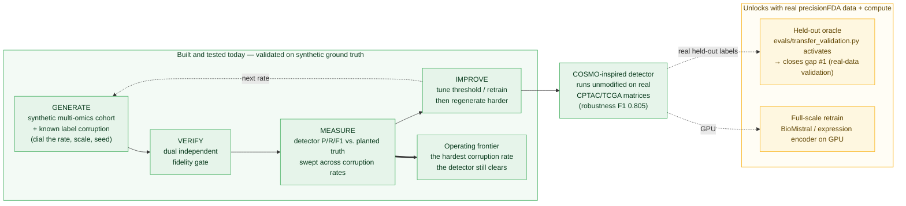
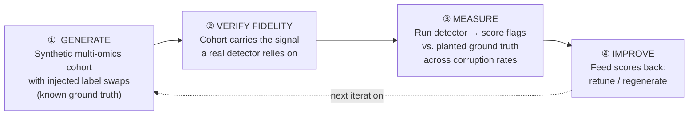
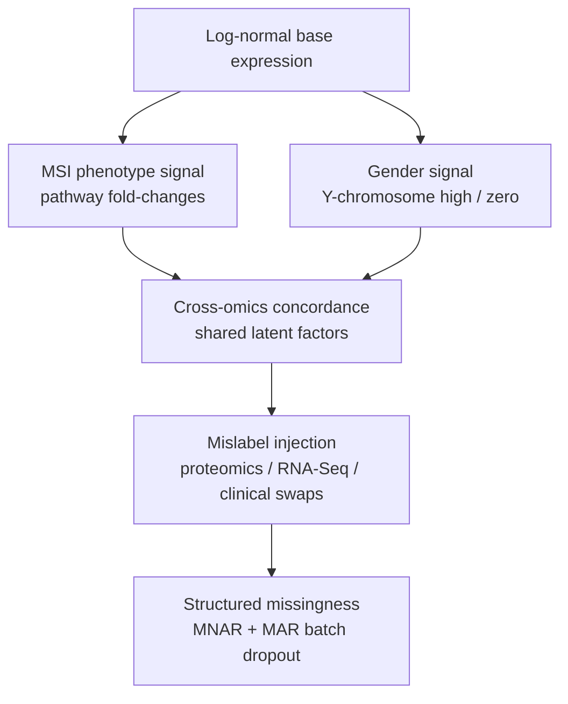
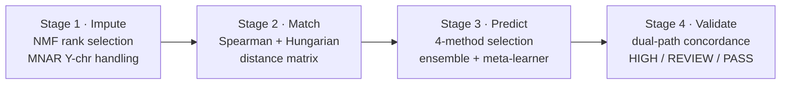
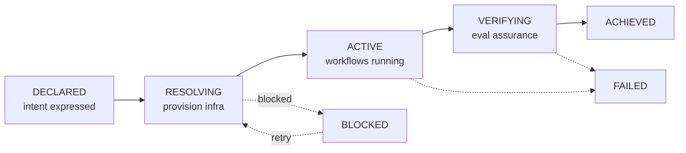

# CLUE — Closed-Loop Upstream Error-correction

> **An agentic loop that generates fidelity-verified synthetic multi-omics cohorts to measure — and ultimately improve — label-error detection at corruption rates real data cannot probe.**

Built on the [precisionFDA NCI-CPTAC Multi-omics Sample Mislabeling Correction Challenge](https://www.nature.com/articles/s41591-018-0180-x).

---

## In one picture

CLUE is a **working instrument for developing and stress-testing sample-mislabel
detectors.** It manufactures the ground truth real cohorts withhold — synthetic
multi-omics data with *known* label corruption you can dial — so you can measure a
detector exactly where real data goes dark, and push it until it breaks. **The
full loop is built and tested today** (green). The same instrument points at real
precisionFDA data the moment the molecular matrices land — that is what turns a
synthetic-validated detector into a real-data-validated one (amber).



**What you can run today** (no GCP, no external data): `python scripts/demo.py`
prints the rate→F1 table and the detector's operating frontier in seconds.
**What's still open:** gap #1 — an independent held-out oracle — is blocked on
real molecular matrices, not on code; the seam is staged and skips gracefully
until they land. Everything below expands on both halves of this picture.

---

## The problem: you can't measure a detector where it matters

In multi-omics precision medicine, the most dangerous errors happen **upstream**, before any model runs: a patient's proteomics, RNA-Seq, or clinical record gets swapped with another's. Mislabeled samples silently corrupt every downstream conclusion — and in the clinic, attribute the wrong data to the wrong patient. The precisionFDA / NCI-CPTAC challenge ([Boja et al., *Nature Medicine* 2018](https://www.nature.com/articles/s41591-018-0180-x)) framed this as a computational task: **detect and correct mislabeled samples** across clinical, proteomics, and RNA-Seq data.

The catch for anyone building a *detector*: **real data can't tell you how good your detector is at the rates you care about.**

- The challenge test set is **~80 samples with unknown, hidden mislabels** — you can't compute precision/recall against ground truth you don't have.
- You can't dial the corruption rate. Does your detector hold at 2%? 15%? 30%? Real cohorts give you one fixed, unknown operating point.
- Cross-validation makes evaluation stochastic, so regressions hide in the noise.

CLUE's answer: **manufacture the ground truth.** Generate synthetic cohorts that carry the same biological signal a real detector relies on, inject known label corruption at a controllable rate and scale, run the detector, and score it against exactly what you planted.

---

## What we show

- **A closed-loop measurement instrument.** CLUE finds the detector's *operating
  frontier* on synthetic cohorts — the hardest corruption rate it still clears —
  at rates real data can't probe. `python scripts/demo.py` prints the rate→F1
  table and the frontier in seconds. **[VALIDATED on synthetic ground truth]**
- **Real-matrix robustness.** The detector runs **unmodified** on real CPTAC/TCGA
  matrices and recovers corruption following COSMO's **published**
  swap/duplicate/shift error taxonomy at a fixed-0.5 F1 of **0.805** over a
  27-condition grid (range [0.559, 0.939]). The error *model* is externally
  defined by COSMO, but the *realized key is authored by us* — so this is a
  **robustness characterization, NOT independent validation**, and it does **not**
  close gap #1. **[ROBUSTNESS, not validation — [docs/TRANSFER_VALIDATION_RUN.md](docs/TRANSFER_VALIDATION_RUN.md)]**
- **Honesty by construction.** The verification gate was hardened across an
  8-finding adversarial audit; the synthetic-vs-real boundary is labeled
  everywhere, and the one open gap (#1, a real held-out oracle) is stated plainly
  rather than buried. **[[docs/GAP_AUDIT.md](docs/GAP_AUDIT.md)]**

---

## The idea: close the loop



| Stage | What it does | Backed by | Status |
|---|---|---|---|
| ① **Generate** | Synthetic cohorts with planted MSI/gender signal and injected proteomics/RNA-Seq/clinical swaps; emits a ground-truth record of every swap | `core/synthetic.py` → `SyntheticCohortGenerator` | ✅ implemented |
| ② **Verify fidelity** | Confirm the cohort is *detectable-by-construction* — planted swaps separate from clean samples under **two mechanically independent** cross-omics detectors (rank-correlation **and** MSE-residual AUROC, AND-gated), with biological signal recoverable and reproducible. This is construction-validity on *synthetic* data; it does **not** establish real-data transfer (gap #1, [PROPOSED] `evals/transfer_validation.py`) | `evals/fidelity_gate.py` → `FidelityGateEval.evaluate_dual` | ✅ implemented |
| ③ **Measure** | Run the COSMO detector, compare flagged samples to the planted swaps, report precision/recall/F1 swept over corruption rate | `evals/mislabel_detection.py` → `MislabelDetectionEval` (detector: `core/cross_omics_matcher.py`) | ✅ implemented |
| ④ **Improve** | Feed the measured score back: tune the detector and regenerate harder cohorts up to the operating frontier | `clue/loop.py` → `CLUELoop`; wired into VERIFY via ml_service `/ml/evaluate` | ✅ implemented |

> **Honest status.** All four loop stages are **implemented and tested**: generate (`core/synthetic.py`), measure (`evals/mislabel_detection.py`), and improve/regenerate (`clue/loop.py`) — the last tunes the detector against planted ground truth and escalates corruption to the detector's operating frontier. The loop is also wired into the platform **intent lifecycle** — `mislabel_detection` is a registered assurance eval whose VERIFY step tunes the detector and gates on the tuned F1. One honest caveat remains: "improve" tunes the detector's *decision threshold*, not full model retraining yet. See [Implementation status](#implementation-status). This README is explicit about what is wired vs. designed.

---

## ① Generate — synthetic cohorts with known corruption

`SyntheticCohortGenerator` (`core/synthetic.py`) produces a complete multi-omics dataset whose every defect is recorded as ground truth.

```python
from core.synthetic import SyntheticCohortGenerator

gen = SyntheticCohortGenerator(
    n_samples=80,
    n_genes_proteomics=5000,
    n_genes_rnaseq=15000,
    msi_fraction=0.4,
    mislabel_fraction=0.05,   # ← dial the corruption rate
    seed=42,
)
cohort = gen.generate_cohort()
# cohort["clinical"], ["proteomics"], ["rnaseq"], ["ground_truth"]
```

The planted ground truth — the answer key a real test set never gives you:

```python
cohort["ground_truth"] = {
    "mislabeled_samples": [...],          # which samples were swapped
    "mislabel_type":      {sid: "proteomics" | "rnaseq" | "clinical"},
    "swap_pairs":         [(sid_a, sid_b), ...],
    "msi_h_samples":      [...],
    "gender_map":         {sid: "Male" | "Female"},
}
```

**Signal layers** (so the cohort behaves like real data, not noise):



**Corruption-rate & scale controls** — the levers real data doesn't have:

| Lever | Parameter | Effect |
|---|---|---|
| Corruption rate | `mislabel_fraction` | Fraction of samples swapped (`max(2, ⌊n·fraction⌋)`, paired) |
| Cohort size | `n_samples` | 20 → 2,000+ |
| Feature dimension | `n_genes_proteomics`, `n_genes_rnaseq` | Stress the high-dimensional / low-N regime |
| Class balance | `msi_fraction` | Match or stress the ~15% MSI-H clinical rate |
| Determinism | `seed` | Same seed → byte-identical cohort → exact regression tests |

**Presets** (as defined in code):

| Preset | Samples | Proteomics genes | RNA-Seq genes | Use |
|---|---|---|---|---|
| `SyntheticCohortGenerator.unit()` | 20 | 100 | 150 | Unit tests (<1s) |
| `SyntheticCohortGenerator.integration()` | 80 | 5,000 | 15,000 | Integration — matches challenge train size |
| `SyntheticCohortGenerator.benchmark()` | 500 | 7,000 | 15,000 | Scale / performance |

---

## ②–③ Verify & Measure — the COSMO detector

The detector is a four-stage pipeline inspired by **COSMO** (Cross-Omics Sample Matching), the post-challenge methodology from the top-3 teams. It produces the flags that stage ③ scores against ground truth.



- **Match** (`core/cross_omics_matcher.py`) — `identify_mismatches()` builds a Spearman distance matrix, solves optimal assignment with the Hungarian algorithm over 100 subsampled iterations, and flags samples whose `mismatch_frequency > 0.5`. Model-free; catches proteomics↔RNA-Seq discordance.
- **Predict** (`core/classifier.py`) — an ensemble of 4 classifiers × 2 phenotype strategies (gender, MSI) stacked into a meta-learner; flags samples whose molecular phenotype contradicts their annotation.
- **Dual-validate** (`core/cross_omics_matcher.py`) — `dual_validate()` cross-checks the two independent flag sources: **HIGH** (both agree) / **REVIEW** (one) / **PASS** (neither). Two-path concordance is what makes a mismatch call trustworthy enough to act on.

**Fidelity verification (②)** keeps the synthetic cohort honest — a cohort whose planted corruption isn't separable carries no signal to detect, so any F1 measured on it would be meaningless. The gate is `evals/fidelity_gate.py` (`FidelityGateEval.evaluate_dual`): it scores molecular-swapped-vs-clean separation by **AUROC** under **two mechanically independent detectors** — the rank-correlation distance (`1−|spearman|`) **and** the MSE-residual linear model — and passes only if **both** clear the bar (an AND gate, flagging `detectors_disagree` when they straddle it). Using two primitives with different failure modes means cohort acceptance no longer rests on the *single* detector's blind spot that stage ③ grades on (gap #3). It is reachable in VERIFY via `/ml/evaluate` (`eval_name="fidelity_gate"`).

> **Honest boundary (gap #1).** Both detectors still read the *same* generator's matrices, so this is a *decorrelated second scorer on synthetic data*, **not** an independent held-out oracle: corruption the generator never planted is invisible to both, and clearing the gate does **not** establish real-data performance. The only true fix is validation against real precisionFDA held-out data + curated labels, which are not in this repo (`data/raw` is empty; the challenge withheld test labels). `evals/transfer_validation.py` is the **[PROPOSED]** seam for that — it skips gracefully until real data lands and never reports a synthetic number as real-data performance. Relatedly, `benchmark_comparison` / `biological_validity` are **not** external-signature validation: their reference fixture is a hardcoded copy of the generator's own `KNOWN_MSI_PATHWAY_MARKERS`.

**Detection measurement (③)** is wired. `MislabelDetectionEval` (`evals/mislabel_detection.py`) runs the cross-omics detector on a generated cohort, scores its flags against the planted `swap_pairs` as precision / recall / F1, and sweeps the corruption rate real data can't provide:

```python
from evals.mislabel_detection import MislabelDetectionEval

# Score detection across corruption rates 10% → 40%
for r in MislabelDetectionEval().sweep([0.10, 0.20, 0.30, 0.40], n_samples=80):
    d = r.details
    print(f"rate={d['mislabel_fraction']:.0%}  P={d['precision']:.2f} R={d['recall']:.2f} F1={d['f1']:.2f}")
```

A clinical-only swap leaves both molecular matrices intact, so it is invisible to the *distance* path — the eval scores it out of scope (and reports it separately) rather than penalising the detector for something that is the classification path's job.

---

## ④ Improve — closing the loop

The loop closes here. `CLUELoop` (`clue/loop.py`) runs **generate → measure → improve → regenerate**, adapting on the measured score:

- **Improve** — chosen by the `improve_mode` lever. `"threshold"` (default) selects the distance detector's decision threshold (on per-sample mismatch frequency) that maximises F1 *against the planted ground truth*. `"retrain"` goes deeper: it **retrains the classification-path ensemble** (`EnsembleMismatchClassifier`) from measured feedback. `"both"` runs both. Either way the detector's effective configuration is chosen by measurement, not by hand.
- **Regenerate harder** — when the tuned detector clears the F1 target, the loop raises the corruption rate and generates a fresh, harder cohort — probing regimes real data can't reach — until it finds the detector's **operating frontier**: the hardest rate it still clears.

```python
from clue.loop import CLUELoop

result = CLUELoop(target_f1=0.80, start_fraction=0.05, max_fraction=0.40).run()
for r in result.rounds:
    print(f"rate={r.mislabel_fraction:.0%}  τ*={r.best_threshold}  F1={r.f1:.2f}  pass={r.passed}")
print("operating frontier:", result.frontier_fraction)   # hardest rate the tuned detector cleared
```

Scope of "improve": two levers, selected by `improve_mode`. (1) the detector's **decision threshold**, tuned against ground truth; (2) **full model retraining** of the classification-path ensemble. The retrain lever observes the project's no-leakage rule: the classifier is fitted on a *separate* train cohort (same corruption rate, **disjoint seed**) and scored on the held-out measure cohort it never saw, so the reported `retrain_f1` is honest unseen-data performance — never the detector's own training set. Loop control (the operating-frontier search) stays keyed on the distance-threshold F1 in every mode; retrain metrics are reported alongside. Hard-example reweighting remains a further lever the structure admits but does not yet drive — stated honestly rather than implied.

### The agentic lifecycle

The same observe→decide→act→verify discipline runs at the platform level as an **intent lifecycle** (inspired by intent-based networking, IETF RFC 9315): an agent declares a goal, the platform provisions what it needs, executes, and verifies against evals before declaring success.



| Intent | Purpose | Success criteria |
|---|---|---|
| **AnalysisIntent** | Biomarker discovery / sample QC | Biological validity ≥ 60%, reproducibility ≥ 85% |
| **TrainingIntent** | Fine-tune BioMistral / expression encoder | Hallucination detection ≥ 90% + adversarial robustness = 100% (both probe the fine-tuned SLM) → auto-deploy |
| **ValidationIntent** | Cross-omics concordance gate | Fidelity gate ≥ 0.80 AUROC, mislabel detection ≥ 0.70 F1, hallucination detection ≥ 90%, adversarial robustness = 100% |

The lifecycle now lives solely in the Go service (`intent-controller/`); the legacy Python reference (`intents/`) has been **decommissioned** after the Go service reached parity, and the controller runs multiple replicas safely via a cross-replica claim/lease (Postgres `FOR UPDATE SKIP LOCKED`). The loop is wired into VERIFY through the ML service: the controller's `RunEval` posts to `ml_service`'s `/ml/evaluate`, which routes `eval_name="mislabel_detection"` (one of six evals) to generate a cohort whose integrity-critical parameters (corruption rate, size, and a seed derived from the server-assigned `intent_id`) are pinned server-side rather than taken from the caller — so the gate cohort can't be seed-shopped — then runs the improve step (threshold tuning by default, or classifier retraining via `improve_mode`) and gates the intent on the resulting F1.

### Skills, tools, evals

| Layer | What |
|---|---|
| **Agent skills** (`web/src/lib/agent-skills/`) | biomarker discovery, sample QC, cross-omics integration, literature grounding (TypeScript) |
| **MCP tools** (`web/src/mcp/`) | genomics + intent-lifecycle tools (TypeScript, MCP SDK) |
| **Evals** (`evals/`) | mislabel detection (P/R/F1 vs. planted ground truth), biological validity (≥0.60), reproducibility (≥0.85), hallucination detection (≥0.90), adversarial robustness (=1.0), benchmark comparison (marker-recovery vs. known signatures — **not** external validation; the reference shares the generator's planted namespace) |

---

## Why synthetic data (and why not *only* synthetic)

| | Real challenge data | CLUE synthetic cohorts |
|---|---|---|
| Mislabel ground truth | Hidden (test set) | Known per-sample |
| Corruption rate | Fixed, unknown | Any rate via `mislabel_fraction` |
| Scale | 80 + 80 samples | 20 → 2,000+ |
| Eval determinism | Stochastic (CV splits) | Byte-identical per seed |

Synthetic data is the **measurement instrument**, not the deliverable. The intended workflow: develop and stress the detector on synthetic cohorts where you can measure it precisely, then validate on the real precisionFDA data as the gold standard, and report both. Real 80-sample data remains the final word on real-world performance.

---

## Implementation status

| Capability | State |
|---|---|
| Synthetic cohort generation + ground truth | ✅ `core/synthetic.py` (tested) |
| Controllable corruption rate / scale / seed | ✅ generator parameters |
| COSMO detector (impute → match → predict → dual-validate) | ✅ `core/` |
| Biological-validity / reproducibility / hallucination / robustness evals | ✅ `evals/` |
| Intent lifecycle (observe-decide-act-verify) | ✅ Go `intent-controller/` (Python `intents/` decommissioned); multi-replica-safe via cross-replica lease |
| Detection scored vs. synthetic ground truth (P/R/F1) across rates | ✅ `evals/mislabel_detection.py` (tested) |
| Closed loop: tune detector + regenerate harder to the operating frontier | ✅ `clue/loop.py` → `CLUELoop` (tested) |
| Fidelity gate uses two independent detectors (rank + MSE-residual, AND-gated) | ✅ `evals/fidelity_gate.py` `evaluate_dual` (tested) — decorrelated second scorer, not a held-out oracle |
| Validation against **real** held-out data (independent oracle) | 🔶 [PROPOSED] `evals/transfer_validation.py` — seam only; skips until real precisionFDA data + curated labels exist (gap #1, not closeable in-repo) |
| Loop wired into intent lifecycle (VERIFY gates on tuned detection) | ✅ via ml_service `/ml/evaluate` eval routing; Go `RunEval` → `mislabel_detection` |
| Full model-retrain feedback (vs. threshold tuning) | ✅ `clue/loop.py` `improve_mode="retrain"/"both"` — held-out retrain on a disjoint cohort (tested) |
| Infrastructure as code | ✅ `infra-ts/` (TypeScript Pulumi); automated deploy currently disabled — see [DEPLOY.md](DEPLOY.md) |

---

## Quick start

**Prerequisites:** Python 3.11+, Docker & Docker Compose (Postgres, Redis).

```bash
git clone https://github.com/hossainpazooki/upstream-label-correction.git
cd upstream-label-correction
pip install -e ".[all]"          # or ".[ml,dev]" for a minimal install
```

Generate a cohort and run the detector — no GCP or external data required:

```python
from core.synthetic import SyntheticCohortGenerator
from core.pipeline import COSMOInspiredPipeline   # see core/pipeline.py

cohort = SyntheticCohortGenerator.integration().generate_cohort()
truth  = cohort["ground_truth"]                   # the planted answer key
# Run the COSMO pipeline over the cohort and compare its flags to `truth`.
```

Services (optional, for the full agentic/API path):

```bash
docker-compose up -d                                              # Postgres, Redis
uvicorn ml_service.main:app --port 8000 --reload                 # ML service (FastAPI)
cd web && npx tsx src/mcp/server.ts                              # MCP server (TypeScript)
```

Tests & checks (these mirror CI — run them before pushing):

```bash
pytest                       # all Python tests
pytest tests/test_evals/                   # just the evals

# Lint AND format — CI's lint job runs BOTH; `ruff check` alone misses formatting:
ruff check        core clue evals training dspy_modules ml_service scripts tests
ruff format --check core clue evals training dspy_modules ml_service scripts tests

# Go engine; integration tests need Postgres (run with -tags=integration):
( cd intent-controller && go build ./... && go vet ./... && go test ./... )
```

---

## Repository layout

```
upstream-label-correction/
├── core/                 # ML engine: synthetic.py (generator), cross_omics_matcher.py,
│                         #   classifier.py, imputation.py, feature_selection.py, pipeline.py
├── evals/                # mislabel detection (vs. ground truth), biological validity,
│                         #   reproducibility, hallucination, adversarial robustness, benchmark
├── clue/                 # closed loop: generate → measure → improve → regenerate (CLUELoop)
├── intent-controller/    # Go intent lifecycle + workflow engine (multi-replica via DB lease)
├── ml_service/           # FastAPI ML service: /ml/* endpoints incl. /ml/evaluate eval routing
├── web/                  # Next.js dashboard + API routes (TypeScript)
├── dspy_modules/         # DSPy prompt optimization
├── training/             # BioMistral QLoRA fine-tuning, expression encoder (GPU/DDP)
├── infra-ts/             # TypeScript Pulumi infrastructure (GCP)
├── tests/                # test suite
└── docs/                 # extended documentation (+ docs/archive/ for retired docs)
```

> Note: the platform has **completed** its migration from a Python monolith to a polyglot split (Go `intent-controller`, TypeScript `web`/`infra-ts`, Python ML core). The Python `intents/` and `workflows/` packages are **decommissioned** — the Go `intent-controller` owns the intent lifecycle and workflow engine, and `ml_service` owns eval execution via `/ml/evaluate`. The migration plan that drove this is retired to [docs/archive/PULUMI_MIGRATION_PLAN.md](docs/archive/PULUMI_MIGRATION_PLAN.md); the current architecture is described above and in [DEPLOY.md](DEPLOY.md).

---

## Documentation

**Current** — describes the system as it stands (post Go/TS split):

- [Technical Writeup](docs/TECHNICAL_WRITEUP.md) — the CLUE loop, COSMO detector, Go intent-controller, integrity model, real-COSMO run
- [Scientific Methodology](docs/SCIENTIFIC_METHODOLOGY.md) — COSMO pipeline, biomarkers, statistical rationale
- [Gap Audit](docs/GAP_AUDIT.md) — gate integrity/honesty findings (correct-shaped-lies lens) and what remains
- [Transfer Validation Run](docs/TRANSFER_VALIDATION_RUN.md) — detector on **real** COSMO matrices: a **robustness characterization, not** independent validation (gap #1 stays open)
- [Temporal-Equivalent Workflow Functionality](docs/TEMPORAL_FUNCTIONALITY.md) — retries + parallel fan-out + cross-replica claim/lease in the Go engine
- [Intent Workflow](docs/INTENT_WORKFLOW.md) — intent lifecycle *(mixed vintage: the Go intent-plane intro is current; the detailed Python-implementation sections are historical — carries a banner)*
- [Learnings](LEARNINGS.md) — hard-won engineering lessons (CI gates, determinism, validity boundaries)
- [Deployment](DEPLOY.md)

**Historical / design-era** — predate the Go/TS split; kept for provenance and carry a banner saying so:

- [Synthetic Data Strategy](docs/SYNTHETIC_DATA_STRATEGY.md) — signal layers, mislabel injection, fidelity criteria *(the generator it describes is current; the surrounding framing is design-era)*
- [Advanced ML Integration](docs/ADVANCED_ML_INTEGRATION.md) — SLM/QLoRA, DSPy, GPU training *(modules exist in `training/`/`dspy_modules/`; the Temporal + Python-monolith orchestration it describes is superseded)*
- [Architecture](docs/ARCHITECTURE.md) — original Skill → Workflow → Eval design
- [Anthropic Alignment](docs/ANTHROPIC_ALIGNMENT.md) — responsible-AI practices and eval design
- [Archived docs](docs/archive/) (incl. the retired [migration plan](docs/archive/PULUMI_MIGRATION_PLAN.md))

## License

Proprietary. Internal use only.
