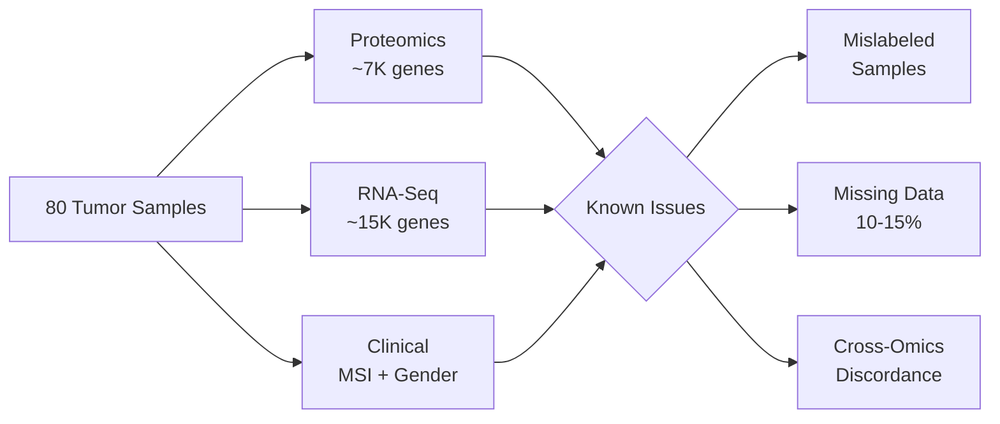
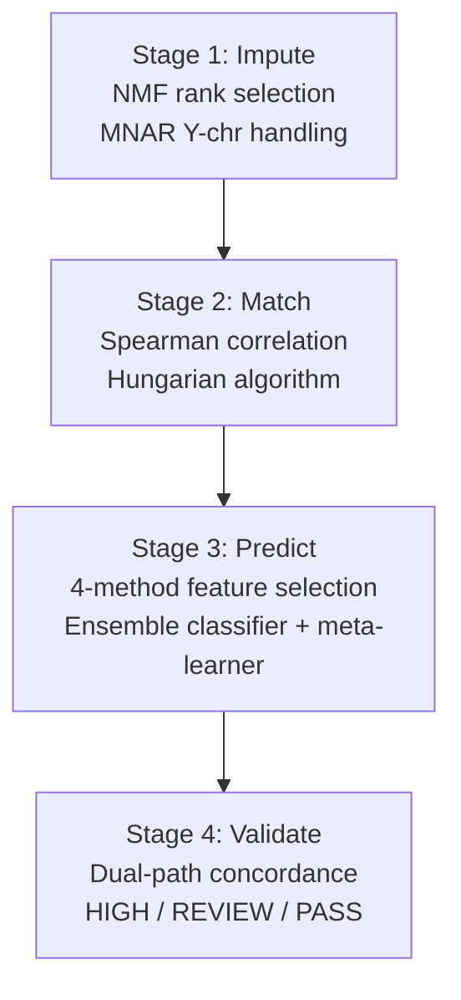
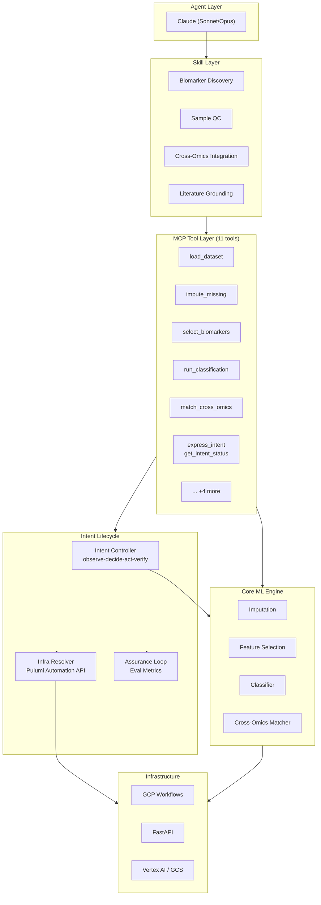
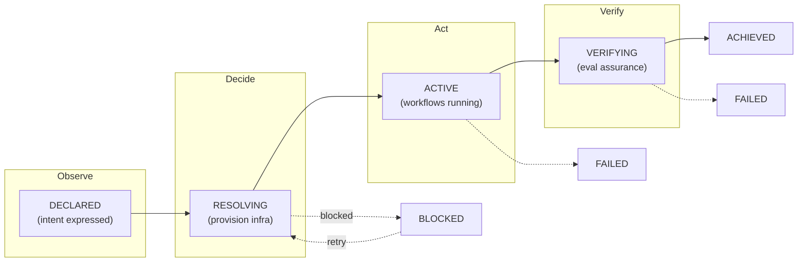
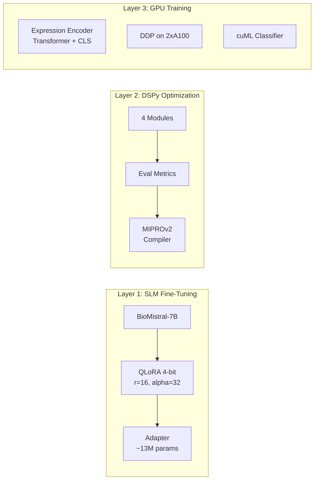
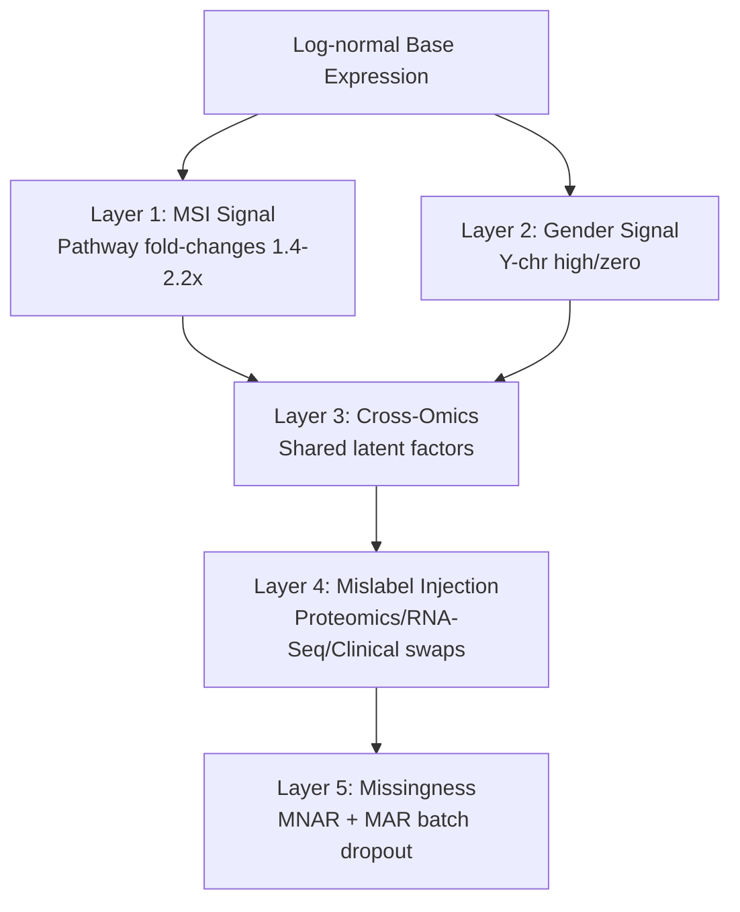
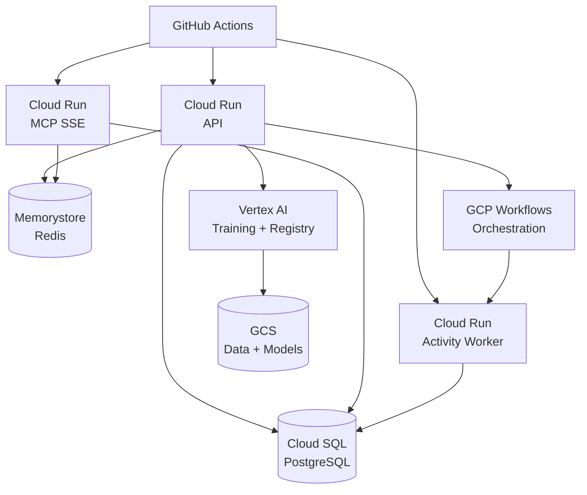

# Precision Genomics Agent Platform

An AI-orchestrated platform for multi-omics MSI classification, built on the [precisionFDA NCI-CPTAC Multi-omics Mislabeling Challenge](https://www.nature.com/articles/s41591-018-0180-x).

## The Challenge

As precision medicine moves beyond genomics to integrate proteomics, transcriptomics, and clinical data, the integrity of multi-omics datasets becomes critical. Sample mislabeling — accidental swapping of patient samples or data — is a [known obstacle in translational research](https://www.nature.com/articles/s41591-018-0180-x) that can lead to patients receiving the wrong treatment with severe, irreversible consequences.

The NCI-CPTAC and FDA launched the precisionFDA Multi-omics Enabled Sample Mislabeling Correction Challenge ([Boja et al., *Nature Medicine* 2018](https://www.nature.com/articles/s41591-018-0180-x)) to address this problem. The challenge asked teams to develop computational algorithms that detect and correct mislabeled samples across clinical, proteomics, and RNA-Seq data — ensuring that **the right data is attributed to the right patient**.

The challenge was structured in two subchallenges: (1) detect mislabeled samples using clinical + proteomics data, then (2) correct mislabels using all three data types (clinical, proteomics, RNA-Seq). This platform implements solutions for both, while also classifying MSI status — a biomarker for immunotherapy response — from the same multi-omics data.

The dataset: 80 tumor samples with paired proteomics (~7K genes) and RNA-Seq (~15K genes) measurements plus clinical metadata including MSI status and gender. The catch: the data contains intentionally introduced mislabels, missing values, and cross-omics discordance that must be resolved before any downstream analysis.



## Methodology

The platform implements a four-stage pipeline inspired by the COSMO (Cross-Omics Sample Matching for Omics) approach.



**Stage 1 — Imputation.** Missing values are classified as MNAR (missing-not-at-random, below detection limit) or MAR (missing-at-random, batch dropout). MNAR values use minimum-value imputation; MAR values use NMF-based matrix completion with automatic rank selection. Y-chromosome genes receive gender-stratified handling.

**Stage 2 — Cross-Omics Matching.** Proteomics and RNA-Seq samples are matched using Spearman correlation across shared genes, producing a distance matrix solved by the Hungarian algorithm for optimal assignment. Mismatched samples are flagged.

**Stage 3 — Feature Selection & Classification.** Four independent feature selection methods vote on the final biomarker panel. An ensemble classifier (logistic regression + random forest + gradient boosting) with a meta-learner produces MSI predictions.

**Stage 4 — Dual Validation.** Proteomics-only and RNA-Seq-only predictions are compared. Concordant predictions receive HIGH confidence; discordant ones are flagged for REVIEW.

### MSI Pathway Biomarkers

| Pathway | Genes | Biological Basis |
|---------|-------|-----------------|
| Immune Infiltration | PTPRC, ITGB2, LCP1, NCF2 | Leukocyte markers elevated in MSI-H |
| Interferon Response | GBP1, GBP4, IRF1, IFI35, WARS | IFN-gamma signaling via neoantigens |
| Antigen Presentation | TAP1, TAPBP, LAG3 | MHC-I pathway in MSI-H tumors |
| Mismatch Repair Adjacent | CIITA, TYMP | Co-regulated with MMR loci |

### Feature Selection Methods

| Method | Algorithm | Selection Criterion |
|--------|-----------|-------------------|
| ANOVA | One-way F-test | Bonferroni + BH correction |
| LASSO | LogisticRegressionCV (L1) | Non-zero coefficients |
| NSC | Soft-thresholded centroids | Cross-validated threshold |
| Random Forest | GridSearchCV, 500 trees | Gini importance ranking |

## System Architecture



### MCP Tools

| Tool | Purpose |
|------|---------|
| `load_dataset` | Load multi-omics TSV data with summary stats |
| `impute_missing` | MNAR/MAR classification + NMF imputation |
| `check_availability` | Gene availability scoring and filtering |
| `select_biomarkers` | 4-method ensemble feature selection |
| `run_classification` | Ensemble classifier training + CV |
| `match_cross_omics` | Distance matrix + Hungarian matching |
| `evaluate_model` | F1, precision, recall, ROC-AUC |
| `explain_features` | Biological pathway explanations (Claude) |
| `explain_features_local` | SLM-based explanations (BioMistral) |
| `express_intent` | Express an intent (analysis/training/validation) and begin its lifecycle |
| `get_intent_status` | Check intent progress, workflow state, and eval results |

### Evaluation Framework

| Eval | Metric | Threshold |
|------|--------|-----------|
| Biological Validity | MSI pathway coverage | >= 60% |
| Hallucination Detection | PubMed citation verification | >= 90% |
| Reproducibility | Pairwise Jaccard over 10 runs | >= 85% |
| Benchmark Comparison | Overlap with published signatures | Any |
| SLM Eval | Combined validity + hallucination for SLM | Pass both |

### Intent Lifecycle

The platform implements an **intent lifecycle** layer inspired by intent-based networking (IETF RFC 9315) that formalizes agent goals as infrastructure-level concerns.



| Intent Type | Purpose | Infra Needs | Success Criteria |
|------------|---------|-------------|------------------|
| **AnalysisIntent** | Biomarker discovery / sample QC | Worker scaled, GCS data staged | Biological validity ≥ 60%, reproducibility ≥ 85% |
| **TrainingIntent** | Fine-tune BioMistral / encoder | Vertex AI job, GPU allocated (max 4) | Job completion → auto-deploy |
| **ValidationIntent** | Cross-omics concordance gate | Minimal | Hallucination detection ≥ 90% |

The intent controller provisions infrastructure via **Pulumi Automation API**, triggers workflows, runs the **eval assurance loop**, and tears down resources on completion. See [docs/INTENT_WORKFLOW.md](docs/INTENT_WORKFLOW.md) for the full lifecycle documentation.

## Advanced ML Integration

Three enhancement layers extend the base pipeline for production use.



**Layer 1 — SLM Fine-Tuning.** BioMistral-7B is fine-tuned with QLoRA (4-bit quantization, rank-16 adapters) on distilled biomarker explanations, producing a local model that replaces Claude API calls for feature interpretation at inference time.

**Layer 2 — DSPy Optimization.** Four DSPy modules (biomarker discovery, feature interpretation, sample QC, regulatory report) are compiled with MIPROv2 to optimize prompts against the evaluation metrics automatically.

**Layer 3 — GPU Training.** A transformer-based expression encoder learns gene expression embeddings via contrastive learning on 2xA100 GPUs with DDP. cuML accelerates downstream classification.

### Training Data Sources

| Source | Count | Method |
|--------|-------|--------|
| Ground Truth | ~50 | Platform constants (KNOWN_MSI_PATHWAY_MARKERS) |
| Distilled | ~500 | Claude-generated, hallucination-filtered |
| Negative | ~150 | Housekeeping genes, no pathway association |

## Synthetic Data Generator

The platform includes a configurable synthetic data generator (`core/synthetic.py`) that produces realistic multi-omics datasets with controllable signal layers for testing and benchmarking.



### Presets

| Preset | Samples | Pro Genes | RNA Genes | Use Case |
|--------|---------|-----------|-----------|----------|
| `unit` | 20 | 100 | 150 | Unit tests (<1s) |
| `integration` | 80 | 5,000 | 15,000 | Integration tests |
| `benchmark` | 500 | 7,000 | 15,000 | Performance benchmarks |

## Quick Start

### Prerequisites

- Python 3.11+
- Docker and Docker Compose (for PostgreSQL, Redis)

### Install

```bash
# Clone and install
git clone https://github.com/hossainpazooki/upstream-label-correction.git
cd upstream-label-correction

# All dependencies (ML, LLM, MCP, GCP, dev)
pip install -e ".[all]"

# Or minimal + specific extras
pip install -e ".[ml,dev]"
```

### Start Infrastructure

```bash
docker-compose up -d
# Starts: PostgreSQL 16 (5432), Redis (6379), Activity Worker (8081)
```

### Run Services

```bash
# API server
uvicorn api.main:app --host 0.0.0.0 --port 8000 --reload

# Activity worker (workflow step executor)
uvicorn workflows.activity_service:app --host 0.0.0.0 --port 8081

# MCP server (SSE transport)
python -m mcp_server.server --transport sse --port 8080
```

### Run Tests

```bash
pytest                    # All tests
pytest --cov              # With coverage
pytest tests/test_evals/  # Specific module
```

## Project Structure

```
upstream-label-correction/
├── agent_skills/                  # High-level agent skills
│   ├── biomarker_discovery.py     #   End-to-end biomarker panel identification
│   ├── cross_omics_integration.py #   Cross-omics concordance analysis
│   ├── literature_grounding.py    #   PubMed citation verification
│   └── sample_qc.py              #   Sample mismatch detection
├── api/                           # FastAPI REST service
│   ├── main.py                    #   App entrypoint
│   ├── middleware/                #   Audit logging, auth
│   └── routes/                    #   Analysis, biomarker, workflow endpoints
├── core/                          # Core ML engine
│   ├── availability.py            #   Feature availability filtering
│   ├── classifier.py              #   Ensemble MSI classifier
│   ├── config.py                  #   Environment configuration
│   ├── constants.py               #   Known MSI markers, pathways
│   ├── cross_omics_matcher.py     #   Spearman + Hungarian matching
│   ├── data_loader.py             #   Multi-omics TSV loader
│   ├── database.py                #   PostgreSQL connection
│   ├── experiment_tracker.py      #   Vertex AI experiment tracking
│   ├── feature_selection.py       #   4-method consensus selection
│   ├── feature_store.py           #   Feature caching layer
│   ├── gpu_classifier.py          #   cuML GPU-accelerated classifier
│   ├── imputation.py              #   MNAR-aware imputation
│   ├── model_registry.py          #   Vertex AI model registry
│   ├── models.py                  #   Pydantic data models
│   ├── pipeline.py                #   COSMO-style orchestration
│   ├── secrets.py                 #   Secret Manager integration
│   ├── sharded_distance.py        #   Distributed distance matrices
│   ├── storage.py                 #   GCS storage abstraction
│   ├── synthetic.py               #   Synthetic data generator
│   └── vertex_training.py         #   Vertex AI custom training
├── dspy_modules/                  # DSPy prompt optimization
│   ├── biomarker_discovery.py     #   Biomarker discovery module
│   ├── compile.py                 #   MIPROv2 compiler
│   ├── feature_interpret.py       #   Feature interpretation module
│   ├── metrics.py                 #   Eval metrics for optimization
│   ├── regulatory_report.py       #   Regulatory report module
│   └── sample_qc.py              #   Sample QC module
├── evals/                         # Evaluation framework
│   ├── benchmark_comparison.py    #   Published signature comparison
│   ├── biological_validity.py     #   MSI pathway coverage
│   ├── hallucination_detection.py #   Citation verification
│   ├── reproducibility.py         #   Run-to-run consistency
│   ├── slm_eval.py                #   SLM-specific evaluation
│   └── fixtures/                  #   Known MSI signatures
├── mcp_server/                    # Model Context Protocol server
│   ├── server.py                  #   MCP server entrypoint
│   ├── schemas/                   #   Request/response schemas
│   └── tools/                     #   11 tools (9 genomics + 2 intent lifecycle)
├── prompts/                       # System prompts for agent orchestration
├── scripts/                       # Training entrypoints
│   ├── compile_dspy.py            #   DSPy compilation script
│   ├── encoder_train_entrypoint.py#   Expression encoder training
│   ├── slm_train_entrypoint.py    #   SLM fine-tuning script
│   └── vertex_train_entrypoint.py #   Vertex AI training job
├── intents/                       # Intent lifecycle layer
│   ├── schemas.py                 #   IntentStatus enum, valid transitions
│   ├── types.py                   #   AnalysisIntentSpec, TrainingIntentSpec, ValidationIntentSpec
│   ├── models.py                  #   SQLModel tables (intents, intent_events)
│   ├── controller.py              #   IntentController (observe-decide-act-verify)
│   ├── infra_resolver.py          #   Maps intent needs → Pulumi Automation API
│   ├── assurance.py               #   Wraps evals/ for success/failure determination
│   └── service.py                 #   create_intent(), get_intent(), get_controller()
├── infra/                         # Pulumi infrastructure (Python)
│   ├── __main__.py                #   Entry point wiring all components
│   ├── config.py                  #   Typed InfraConfig dataclass
│   ├── components/                #   9 ComponentResources (networking, database, etc.)
│   ├── policies/                  #   CrossGuard policy-as-code (8 compliance policies)
│   ├── automation/                #   Automation API (ML-triggered deploys, ephemeral envs)
│   ├── tests/                     #   pytest infrastructure unit tests
│   └── Pulumi.{dev,staging,prod}.yaml  # Multi-environment stack configs
├── terraform/                     # Legacy Terraform (migrated to Pulumi)
│   ├── main.tf                    #   Root module
│   ├── variables.tf / outputs.tf  #   Config and outputs
│   └── modules/                   #   cloud_run, cloud_sql, gcs, vertex_ai, ...
├── training/                      # ML training modules
│   ├── data_builder.py            #   Training data generation
│   ├── expression_encoder.py      #   Transformer gene encoder
│   ├── finetune_slm.py            #   BioMistral QLoRA fine-tuning
│   ├── explainer.py               #   Distillation data generation
│   ├── gpu_configs.py             #   GPU training configurations
│   └── train_encoder_ddp.py       #   DDP distributed training
├── workflows/                     # GCP Workflows orchestration
│   ├── activity_service.py        #   FastAPI activity worker service
│   ├── local_runner.py            #   Local workflow runner (dev)
│   ├── progress.py                #   Execution progress tracking
│   ├── definitions/               #   GCP Workflow YAML definitions
│   └── activities/                #   Workflow activity implementations
├── tests/                         # Test suite
├── data/                          #   raw/ and processed/
├── docs/                          # Extended documentation
├── docker-compose.yml             # Local infrastructure
├── Dockerfile.ml                  # Python ML service container
├── Dockerfile.trainer             # GPU training container (Vertex AI)
├── web/Dockerfile                 # Next.js web app container
├── web/Dockerfile.mcp             # MCP server container (TypeScript)
├── intent-controller/Dockerfile   # Go intent controller container
└── pyproject.toml                 # Dependencies and project config
```

## Deployment



All GCP features are optional and gated by environment variables. Local development works without any GCP configuration.

### Infrastructure (Pulumi)

Infrastructure is managed with [Pulumi](https://www.pulumi.com/) using the **TypeScript SDK**. The `infra-ts/` directory contains 8 reusable `ComponentResource` classes that map 1:1 to the GCP services above.

```bash
cd infra-ts
npm ci
pulumi stack select dev
pulumi preview        # Review changes
pulumi up             # Deploy
```

**Key features:**
- **CrossGuard policies** — `infra-ts/policies/` enforces compliance guardrails (PITR, versioning, private networking, resource limits) on the stack
- **Multi-environment** — per-stack config (`Pulumi.dev.yaml`)
- **CI/CD** — GitHub Actions; note the automated GCP deploy is currently **disabled** pending the `infra-ts`/Pulumi workflow rewrite (see [DEPLOY.md](DEPLOY.md))

See [DEPLOY.md](DEPLOY.md) for full deployment instructions. The legacy Terraform and Python-Pulumi stacks have been retired — see [docs/archive/](docs/archive/).

## Documentation

- [Architecture](docs/ARCHITECTURE.md) — system design and component interactions
- [Intent Workflow](docs/INTENT_WORKFLOW.md) — intent lifecycle, state machine, and infrastructure resolution
- [Scientific Methodology](docs/SCIENTIFIC_METHODOLOGY.md) — statistical methods and biological rationale
- [Anthropic Alignment](docs/ANTHROPIC_ALIGNMENT.md) — responsible AI practices and eval design
- [Deployment](DEPLOY.md) — infra-ts/Pulumi infrastructure, image build/push, and CI/CD
- [Pulumi Migration Plan](PULUMI_MIGRATION_PLAN.md) — active Go + TypeScript migration plan
- [Advanced ML Integration](docs/ADVANCED_ML_INTEGRATION.md) — SLM, DSPy, and GPU training details
- [Synthetic Data Strategy](docs/SYNTHETIC_DATA_STRATEGY.md) — data generation methodology
- [Archived docs](docs/archive/) — superseded plans and deployment guides (historical reference)

## License

Proprietary. Internal use only.
